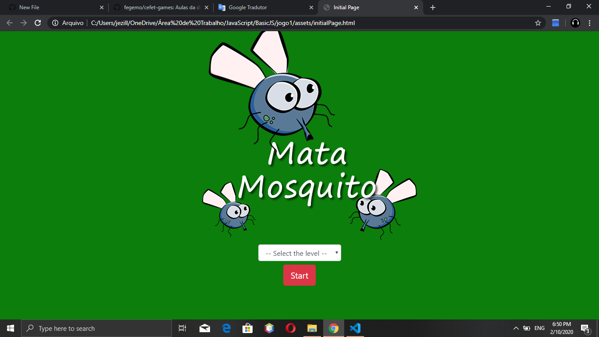
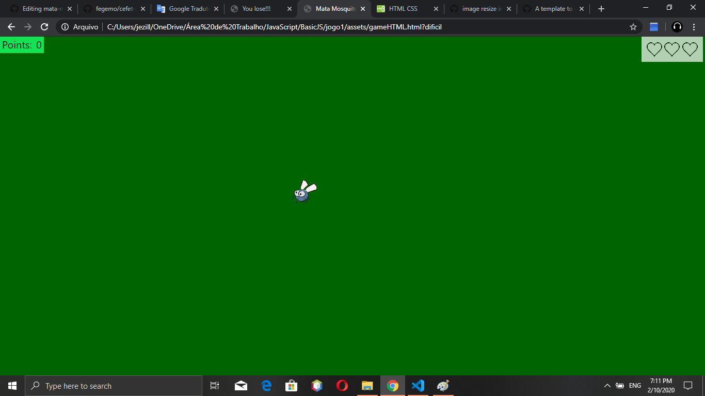
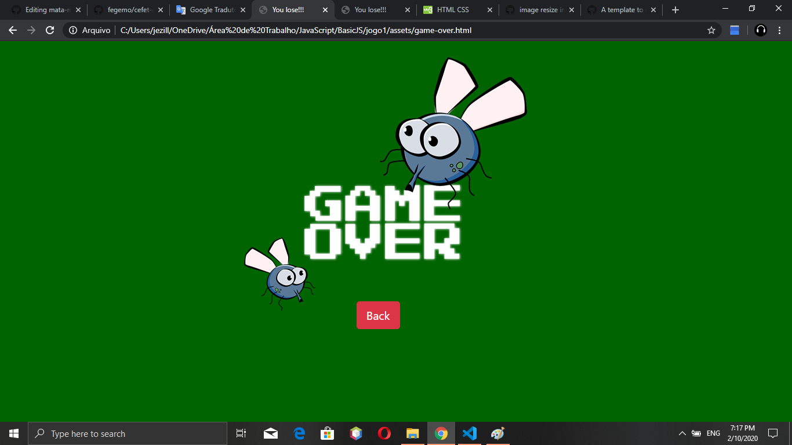

<h2>JOGO MATA-MOSQUITO(HTML,CSS,JS)</h2>

Jogo Simples com níveis de dificuldade que fazem variar a quantidade de mosquitos a serem eliminados com a ajuda do cursor do mouse

   
   
<ul>
   <li>Eazy</li>
   <li>Normal</li>
   <li>WTF</li>
<ul>      

   
   
